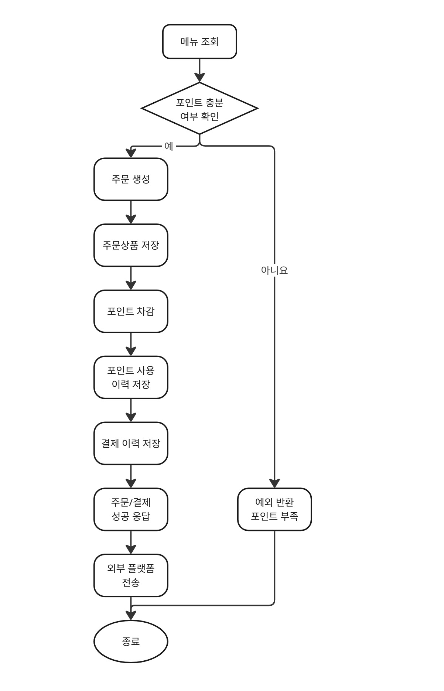
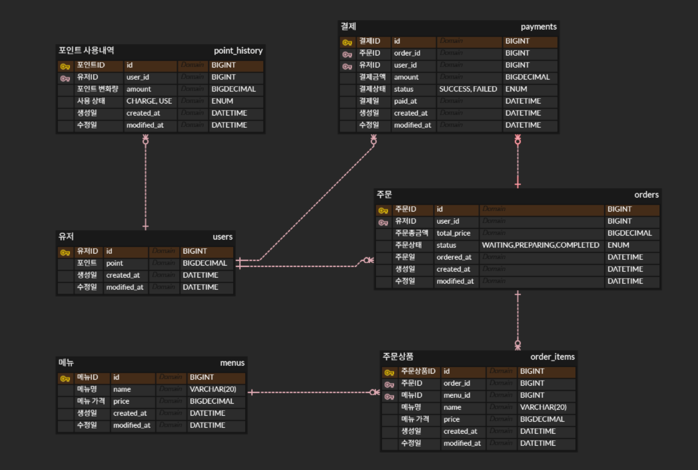

# ☕ Coffee Order System

포인트 기반으로 커피 메뉴를 조회하고, 충전한 포인트로 주문 및 결제를 진행할 수 있는 커피 주문 서비스입니다.

---

## 📌 주요 기능

- 메뉴 조회
- 포인트 충전 및 사용
- 주문 생성 및 결제
- 외부 플랫폼 주문 데이터 전송 (Mock)
- 최근 7일 기준 인기 메뉴 조회

---

## 🧩 핵심 도메인

- **User**: 포인트 관리
- **Menu**: 커피 메뉴 정보
- **Order / OrderItem**: 주문 및 상품 정보
- **Payment**: 결제 이력 관리
- **PointHistory**: 포인트 변동 이력

---

## 🧠 기술적 포인트

- 트랜잭션 기반 데이터 정합성 보장
- 이벤트 기반 비동기 처리
- 비관적 락 기반 동시성 제어
- 인덱스 및 캐싱을 통한 성능 최적화

---

## ⚙️ 핵심 설계

- 주문 생성, 포인트 차감, 결제 저장을 하나의 트랜잭션으로 처리
- 주문 시점의 메뉴 정보를 스냅샷으로 저장
- 포인트 부족 시 결제 실패 처리
- 인기 메뉴는 최근 7일 주문 데이터 기준으로 집계

---

## 🚀 기술적 고민 및 설계

### 1. 트랜잭션 처리
주문 생성, 포인트 차감, 결제 이력 저장이 개별적으로 수행될 경우  
중간 실패 시 데이터 불일치가 발생할 수 있다고 판단합니다.

→ 이를 방지하기 위해 해당 작업들을 하나의 트랜잭션으로 묶어  
데이터 정합성을 보장하는 방향으로 설계하고자 합니다.

→ 일부 단계에서 실패하더라도 전체 롤백이 이루어지도록 하여  
잘못된 포인트 차감이나 주문 데이터 불일치를 방지할 수 있도록 고려합니다.

---

### 2. 외부 플랫폼 연동 분리
주문/결제 성공 이후 외부 데이터 수집 플랫폼으로 주문 정보를 전송하는 구조를 고려합니다.

→ 핵심 주문/결제 로직과 외부 연동 로직을 분리하여  
시스템의 책임을 명확히 하고 확장성을 확보하고자 합니다.

→ 외부 API 호출로 인한 응답 지연을 고려하여  
비동기 처리 또는 메시지 큐 기반 구조로 확장할 수 있도록 설계합니다.

→ 과제에서는 Mock API 형태로 구현하여 외부 연동 흐름을 검증할 예정입니다.

---

### 3. 동시성 제어
여러 결제 요청이 동시에 발생할 경우, 사용자 포인트 차감 과정에서  
데이터 정합성이 깨질 수 있는 문제가 발생할 수 있다고 판단합니다.

→ 이에 따라 사용자 포인트 차감 시 동시성 제어가 필요하다고 판단하며,  
중복 차감 및 데이터 불일치를 방지하는 방향으로 설계하고자 합니다.

---

### 4. 인기 메뉴 집계 설계
최근 7일간 주문 데이터를 기준으로 인기 메뉴를 집계해야 하므로  
실시간 집계 시 조회 성능 저하가 발생할 수 있다고 판단합니다.

- 초기 구현 방향:  
  → 별도의 집계 테이블 없이 `order_items` 기반 집계 쿼리 사용

- 확장 고려:  
  → 트래픽 증가 시 Redis 캐싱 또는 집계 테이블 도입 가능하도록 설계

---

## 🛠 기술 스택

- Java 17
- Spring Boot
- MySQL
- Spring Data JPA
- Redis (캐싱 및 확장 고려)

---

## 🔄 플로우차트



---

## 🔗 ERD



---

## ✅ 비즈니스 규칙

- 포인트는 1원 = 1포인트로 충전됩니다.
- 사용자는 원하는 금액만큼 자유롭게 포인트를 충전할 수 있도록 설계합니다.
- 충전 금액은 0보다 커야 합니다.
- 존재하지 않는 사용자 또는 메뉴로는 주문할 수 없습니다.
- 보유 포인트가 부족하면 결제를 진행할 수 없습니다.
- 결제 실패 시 포인트는 차감되지 않습니다.
- 주문 시점의 메뉴명과 가격은 이후 메뉴 정보가 변경되더라도 유지되어야 합니다.
- 주문 생성, 포인트 차감, 결제 저장은 하나의 트랜잭션으로 처리됩니다.
- 외부 플랫폼 전송은 결제 성공 이후 수행됩니다.
- 인기 메뉴는 최근 7일 이내 주문 데이터를 기준으로 집계됩니다.

---

## 📖 API 명세서

| 기능 분류 | 기능명 | API Path | Method |
|----------|--------|----------|--------|
| user | 사용자 목록 조회 | `/api/users` | GET |
| user | 사용자 단건 조회 | `/api/users/{userId}` | GET |
| user | 사용자 포인트 조회 | `/api/users/{userId}/points` | GET |
| user | 포인트 충전 | `/api/users/{userId}/points/charge` | POST |
| menu | 메뉴 목록 조회 | `/api/menus` | GET |
| menu | 메뉴 단건 조회 | `/api/menus/{menuId}` | GET |
| menu | 인기 메뉴 조회 | `/api/menus/popular` | GET |
| order | 주문 생성 + 결제 | `/api/orders` | POST |
| order | 주문 단건 조회 | `/api/orders/{orderId}` | GET |
| order_item | 주문 상품 조회 | `/api/orders/{orderId}/items` | GET |
| payment | 결제 정보 조회 | `/api/payments/{orderId}` | GET |
| pointhistory | 포인트 이력 조회 | `/api/points/history/{userId}` | GET |

---

## 📁 프로젝트 구조

```plaintext
src
├─ main
│  ├─ java
│  │  └─ com.example.coffeeordersystem
│  │     ├─ domain
│  │     │  ├─ menu
│  │     │  ├─ order
│  │     │  ├─ payment
│  │     │  ├─ pointhistory
│  │     │  └─ user
│  │     ├─ external
│  │     │  ├─ client
│  │     │  ├─ controller
│  │     │  ├─ dto
│  │     │  └─ event
│  │     ├─ global
│  │     │  ├─ common
│  │     │  ├─ config
│  │     │  └─ exception
│  │     └─ CoffeeOrderSystemApplication
│  └─ resources
│     ├─ application.properties
│     └─ data.sql
└─ test
   └─ java
      └─ com.example.coffeeordersystem
         └─ CoffeeOrderSystemApplicationTests
```

---

## 🚀 외부 플랫폼 전송 개선

기존에는 `@Async`를 사용하여 외부 API를 비동기로 호출했습니다.

하지만 트랜잭션과 분리되지 않아 롤백 상황에서도 외부 API가 호출될 수 있는 문제가 있었습니다.

→ 이를 해결하기 위해 이벤트 기반 비동기 구조로 변경했습니다.

```java
@Async
@TransactionalEventListener(phase = TransactionPhase.AFTER_COMMIT)
```

### ✨ 개선 효과
- 트랜잭션과 외부 API 호출 분리
- commit 이후 실행으로 데이터 정합성 보장
- 확장 가능한 구조 확보

---

## 🔒 포인트 차감 동시성 제어 개선

기존에는 여러 요청이 동시에 들어올 경우 동일한 포인트를 기준으로 중복 차감이 발생할 수 있는 구조였습니다.

→ 이를 해결하기 위해 사용자 조회 시 비관적 락(Pessimistic Lock)을 적용했습니다.

```java
@Lock(LockModeType.PESSIMISTIC_WRITE)
```

### ✨ 개선 효과
- 동시 요청 상황에서 포인트 정합성 보장
- 중복 차감 방지
- 결제 처리 안정성 향상

---

## ⚡ 인기 메뉴 조회 성능 개선

인기 메뉴 조회 과정에서 최근 7일 데이터 조회 시 Full Table Scan이 발생하는 구조였습니다.

→ 이를 해결하기 위해 `Order.created_at` 컬럼에 인덱스를 추가했습니다.

```java
@Table(
    name = "orders",
    indexes = {
        @Index(name = "idx_order_created_at", columnList = "created_at")
    }
)
```

### ✨ 개선 효과
- Full Table Scan → 인덱스 기반 조회로 개선
- range scan 기반으로 조회 효율 향상
- 인기 메뉴 조회 성능 개선
- EXPLAIN으로 인덱스 사용 여부 검증

---

## ⚡ 인기 메뉴 조회 캐싱 적용

인덱스를 적용했지만, 여전히 요청마다 DB 조회가 발생했습니다.

특히 인기 메뉴는 조회는 많고 변경은 적으며,
동일한 결과가 반복 조회되는 특징이 있었습니다.

→ 이러한 특성을 고려하여 Redis 캐싱을 도입해 반복 조회를 최적화했습니다.

```java
@Cacheable(value = "popularMenus")
public List<PopularMenuResponse> getPopularMenus() {
}

@CacheEvict(value = "popularMenus", allEntries = true)
public OrderResponse createOrder(...) {
}
```

### ✨ 개선 효과
- 반복 조회 시 DB 접근 제거
- 캐시 히트 시 빠른 응답 (DB 조회 없이 반환)
- 주문 발생 시 캐시 무효화를 통한 데이터 정합성 유지

---

## 🧪 테스트

서비스 레이어 전반에 대해 단위 테스트를 작성하여  
비즈니스 로직의 정상 동작과 예외 상황을 검증했습니다.

### ✔ 서비스 로직 검증
- 주요 서비스(Menu, Order, Payment, User 등) 테스트 코드 작성
- 성공/실패 케이스 검증
- Mockito 기반 Repository mocking
- 이벤트 발행 로직 검증
- 불필요한 repository 호출 방지 검증

### ✔ 동시성 테스트
주문 생성 시 동시성 테스트를 통해  
비관적 락 기반 동시성 제어가 정상적으로 동작하는지 검증했습니다.

- 동시에 2건 요청 시 1건만 성공하도록 검증
- 포인트가 한 번만 차감되는지 확인

---

## 🎯 마무리

이번 프로젝트를 통해 설계를 먼저 진행한 후 구현을 시작하는 과정의 중요성을 체감할 수 있었습니다.  
또한 단순 기능 구현을 넘어 트랜잭션, 동시성, 성능 개선까지 단계적으로 고민하며 설계하는 경험이 인상 깊었습니다.

특히 직접 문제를 해결해나가는 과정에서 단계적인 접근의 중요성을 깨달았으며,  
좋은 설계는 한 번에 완성되는 것이 아니라 지속적으로 개선되어야 한다는 점을 배울 수 있었습니다.

---

## 📌 프로젝트 관련 글

설계부터 회고까지 프로젝트 전 과정을 정리한 기록입니다.

### 🧩 설계
- [도메인 설계] https://sudaruuu.tistory.com/111
- [API 명세서 개선] https://sudaruuu.tistory.com/115

### 🔥 회고
- [프로젝트 회고] https://sudaruuu.tistory.com/127
